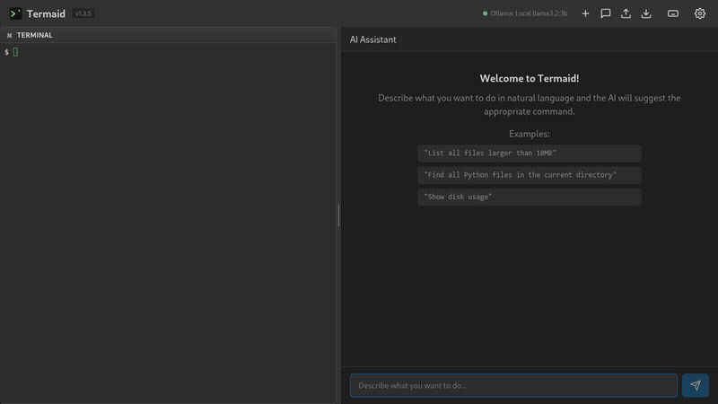

# Termaid - AI-Powered Terminal

[](https://opensource.org/licenses/MIT)
[](https://github.com/openhoat/termaid/actions/workflows/ci.yml)
[](https://codecov.io/gh/openhoat/termaid)


[](https://github.com/openhoat/termaid/stargazers)
[](https://github.com/openhoat/termaid/network/members)
[](https://github.com/openhoat/termaid/issues)

A modern terminal powered by artificial intelligence, inspired by [Warp](https://www.warp.dev).

Termaid allows you to describe what you want to do in natural language and the AI generates the appropriate shell commands.

> 🤖 **This project was entirely built with AI** — from architecture to code, tests, and documentation, using [Claude Code](https://claude.ai/claude-code) (Anthropic).

## 🎬 Demo



*Generate shell commands from natural language and get AI-powered interpretations of command output.*

📖 **[Full Documentation](https://openhoat.github.io/termaid/)**

## 💡 Why Termaid?

[Warp](https://www.warp.dev) is a great AI-powered terminal, but its AI features only work with proprietary cloud providers — there is no support for [Ollama](https://ollama.ai), which means no free, local, or self-hosted option.

Termaid was born out of that frustration: a fully open alternative that works with Ollama out of the box, keeping your data local and your wallet intact.

## 🚀 Features

- **Terminal Base**: Full terminal interface with xterm.js
- **Integrated AI**: Generate shell commands from natural language descriptions
- **Multi-Provider LLM**: Supports [Ollama](https://ollama.ai) (local/remote), [Claude](https://www.anthropic.com) (Anthropic API), and [OpenAI](https://openai.com) (GPT-4o, GPT-4)
- **Modern Interface**: Dark theme by default with optional light theme
- **Flexible Configuration**: Provider, model, temperature, and more — configurable via UI or environment variables
- **History**: Track conversations and executed commands

## 🤖 Recommended Ollama Models

Termaid uses **llama3.2:3b** as the default Ollama model, offering a good balance between performance and resource usage.

### Alternative Models

Depending on your hardware and needs, you can configure alternative models:

| Model | Size | RAM Required | Description |
|-------|------|--------------|-------------|
| **llama3.2:3b** | 3B | ~4 GB | Default - Best balance of speed and quality |
| **llama3.1:8b** | 8B | ~8 GB | More powerful, better for complex commands |
| **mistral:7b** | 7B | ~6 GB | Good compromise between performance and quality |
| **qwen2.5:3b** | 3B | ~4 GB | Lightweight alternative, fast responses |

### Changing the Model

You can change the model in the configuration panel (⚙️ icon) or via the environment variable:

```bash
export TERMAID_OLLAMA_MODEL=llama3.1:8b
```

For more details, see the [Configuration guide](https://openhoat.github.io/termaid/guide/configuration).

## 📥 Quick Install

Download the latest release for your platform:

| Platform | Format | Download |
|----------|--------|----------|
| **Linux** | AppImage | [Termaid-1.2.3.AppImage](https://github.com/openhoat/termaid/releases/latest/download/Termaid-1.2.3.AppImage) |
| **Linux** | Debian/Ubuntu | [termaid_1.2.3_amd64.deb](https://github.com/openhoat/termaid/releases/latest/download/termaid_1.2.3_amd64.deb) |
| **macOS** | DMG (ARM) | [Termaid-1.2.3-arm64.dmg](https://github.com/openhoat/termaid/releases/latest/download/Termaid-1.2.3-arm64.dmg) |
| **Windows** | Installer | [Termaid.Setup.1.2.3.exe](https://github.com/openhoat/termaid/releases/latest/download/Termaid.Setup.1.2.3.exe) |

> See all versions on the [Releases page](https://github.com/openhoat/termaid/releases).

## 🔧 Development Setup

```bash
git clone https://github.com/openhoat/termaid.git
cd termaid
npm install
npm run dev
```

**Prerequisites**: Node.js 18+, npm, and an LLM provider (Ollama, Claude, or OpenAI).

> See the [Getting Started guide](https://openhoat.github.io/termaid/guide/getting-started) for detailed setup instructions including LLM provider configuration.

## 📖 Documentation

- [Getting Started](https://openhoat.github.io/termaid/guide/getting-started) — Installation and provider setup
- [Usage](https://openhoat.github.io/termaid/guide/usage) — How to use the AI assistant and keyboard shortcuts
- [Configuration](https://openhoat.github.io/termaid/guide/configuration) — Provider settings and environment variables
- [Build Executables](https://openhoat.github.io/termaid/guide/build) — Package the app for distribution
- [Troubleshooting](https://openhoat.github.io/termaid/guide/troubleshooting) — Common issues and solutions
- [Contributing](https://openhoat.github.io/termaid/guide/contributing) — How to contribute to the project
- [Changelog](https://github.com/openhoat/termaid/blob/main/CHANGELOG.md) — Version history and release notes

## 🔒 Security

- Commands proposed by AI are not executed automatically
- You always have control: validation before execution
- Ability to modify commands before execution
- Configuration stored locally with electron-store

## 📄 License

This project is licensed under the MIT License - see the [LICENSE.txt](LICENSE.txt) file for details.

Copyright © 2026 Olivier Penhoat

## 👨‍💻 Author

Olivier Penhoat <openhoat@gmail.com>

## 🙏 Acknowledgments

- [Warp](https://www.warp.dev) for the inspiration
- The Ollama team for their excellent tool
- Anthropic for the Claude API
- [Claude Code](https://claude.ai/claude-code) — the AI assistant that built this project
- The open-source community
