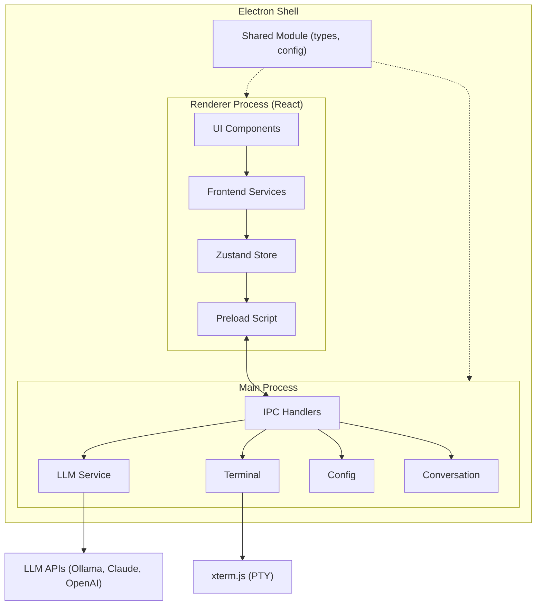
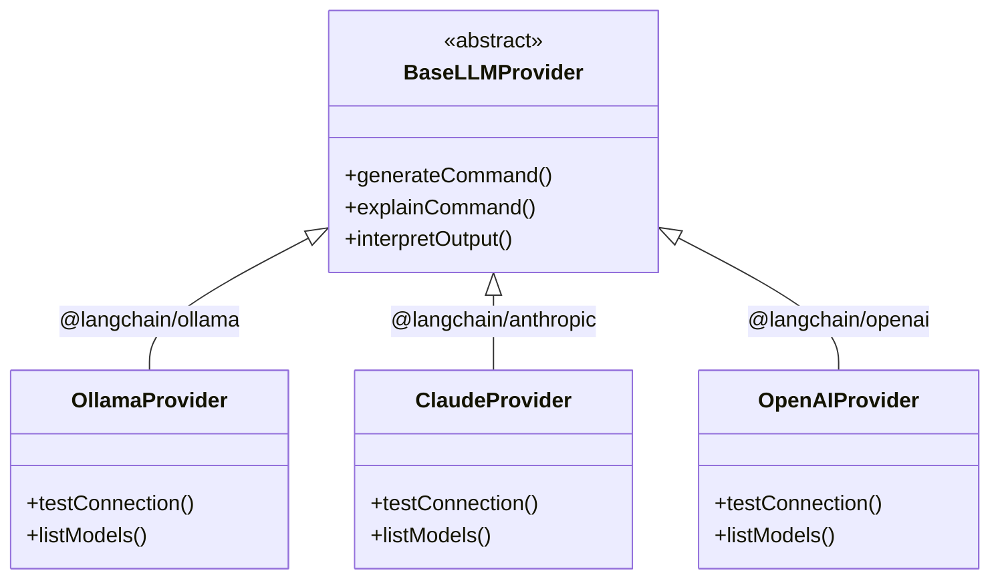
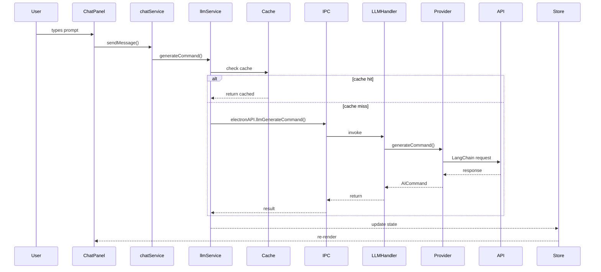
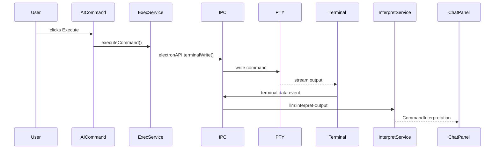

# Architecture

Termaid is an Electron desktop application with a React frontend. This page describes the high-level architecture, the main modules, and how data flows through the application.

## Overview



## Project Structure

```
termaid/
├── src/                    # Renderer process (React)
│   ├── components/         # React components
│   ├── services/           # Frontend services (LLM, chat, terminal, config)
│   ├── store/              # Zustand state management
│   ├── hooks/              # Custom React hooks
│   ├── locales/            # i18n translations (en, fr)
│   ├── types/              # Frontend-specific types
│   └── utils/              # Utilities (logger)
├── electron/               # Main process (Electron)
│   ├── main.ts             # App entry point, window creation
│   ├── preload.ts          # Context bridge (IPC API)
│   ├── ipc-handlers/       # IPC handler modules
│   │   ├── providers/      # LLM provider implementations
│   │   ├── llm-service.ts  # LLM IPC routing
│   │   ├── terminal.ts     # PTY terminal management
│   │   ├── config.ts       # Configuration persistence
│   │   └── conversation.ts # Conversation storage
│   ├── services/           # Backend services
│   └── prompts/            # LLM prompt templates
├── shared/                 # Shared between renderer and main
│   ├── types.ts            # Shared TypeScript interfaces
│   ├── config.ts           # Default config, env var merging
│   ├── ansi.ts             # ANSI escape code utilities
│   └── promptDetection.ts  # Shell prompt detection
├── docs/                   # VitePress documentation
└── tests/                  # E2E tests (Playwright)
```

## Renderer Process (Frontend)

The renderer runs in a sandboxed Chromium context with no direct Node.js access. It communicates with the main process exclusively through the preload bridge.

### Components

| Component | File | Role |
|-----------|------|------|
| `App` | `src/App.tsx` | Root layout: header, terminal, chat panel, config |
| `Terminal` | `src/components/Terminal.tsx` | xterm.js terminal emulator |
| `ChatPanel` | `src/components/ChatPanel.tsx` | AI chat interface with conversation history |
| `Header` | `src/components/Header.tsx` | App header with action buttons |
| `ConfigPanel` | `src/components/ConfigPanel.tsx` | Settings modal (provider, model, theme) |
| `Resizer` | `src/components/Resizer.tsx` | Draggable panel resizer |
| `AICommand` | `src/components/chat/AICommand.tsx` | Renders AI-generated shell commands |
| `ChatMessage` | `src/components/chat/ChatMessage.tsx` | Renders conversation messages |
| `CommandInterpretation` | `src/components/chat/CommandInterpretation.tsx` | Renders command output analysis |

### Services

| Service | File | Role |
|---------|------|------|
| `LLMService` | `src/services/llmService.ts` | LLM API wrapper with response caching |
| `chatService` | `src/services/chatService.ts` | Chat flow orchestration |
| `commandExecutionService` | `src/services/commandExecutionService.ts` | Shell command execution and output capture |
| `terminalService` | `src/services/terminalService.ts` | Terminal lifecycle management |
| `configService` | `src/services/configService.ts` | Configuration read/write |
| `ollamaService` | `src/services/ollamaService.ts` | Ollama-specific helpers (model listing) |

### State Management

The application uses a single **Zustand** store (`src/store/useStore.ts`) that manages:

- **Config** — active LLM provider settings, theme, font size, shell
- **Terminal** — PTY process ID, captured output buffer
- **AI** — current AI command response, loading state, errors
- **Conversations** — list, current conversation, CRUD operations
- **UI** — config panel visibility, selected command

## Main Process (Backend)

The Electron main process handles system-level operations through IPC handlers.

### IPC Handlers

Each handler module registers `ipcMain.handle()` listeners:

| Handler | Channel prefix | Role |
|---------|---------------|------|
| `terminal` | `terminal:*` | Create/write/resize/destroy PTY processes |
| `llm-service` | `llm:*` | Route LLM requests to the active provider |
| `config` | `config:*` | Persist/retrieve config via `electron-store` |
| `conversation` | `conversation:*` | CRUD for conversation history (JSON files) |
| `video` | — | Desktop capture for demo recording |

### LLM Provider System

LLM providers follow a **strategy pattern** with a shared base class:



`BaseLLMProvider` (`electron/ipc-handlers/providers/base-provider.ts`) implements:
- `generateCommand()` — structured output with Zod schema validation and fallback parsing
- `explainCommand()` — free-text explanation of a shell command
- `interpretOutput()` — structured analysis of command output

Each provider only needs to initialize its LangChain chat model and implement `testConnection()` and `listModels()`.

### Preload Bridge

The preload script (`electron/preload.ts`) uses `contextBridge.exposeInMainWorld()` to expose a typed `window.electronAPI` object. This is the **only** communication channel between renderer and main process, ensuring full context isolation and sandbox security.

## Shared Module

The `shared/` directory contains code used by both processes:

| File | Purpose |
|------|---------|
| `types.ts` | Core interfaces: `AppConfig`, `AICommand`, `Conversation`, `ConversationMessage` |
| `config.ts` | Default configuration, environment variable loading and merging |
| `ansi.ts` | ANSI/OSC escape code stripping for clean terminal output |
| `promptDetection.ts` | Shell prompt pattern detection (bash, zsh, fish, PowerShell) |

## Data Flow

### Command Generation



### Command Execution



## Technology Stack

| Layer | Technology |
|-------|-----------|
| Desktop shell | Electron 40 |
| Frontend framework | React 19 |
| Language | TypeScript 5.9 |
| Terminal emulator | xterm.js |
| State management | Zustand |
| LLM integration | LangChain.js |
| LLM providers | Ollama, Anthropic Claude, OpenAI |
| Build tool | Vite |
| Packaging | electron-builder |
| Testing | Vitest + Testing Library (unit), Playwright (E2E) |
| Linting | Biome |
| Documentation | VitePress |
| i18n | react-i18next |
| Config storage | electron-store |

## Security Services

### Sandbox Service

The sandbox service (`shared/sandbox.ts`) provides multiple levels of isolation for command execution:

**Sandbox Modes:**

| Mode | Description | Use Case |
|------|-------------|----------|
| `none` | Direct execution, no isolation | Trusted commands only |
| `restricted` | Limited environment with blocked commands | Most commands, safe default |
| `docker` | Container isolation with Docker | Untrusted commands, testing |
| `system` | OS sandbox (firejail on Linux) | Maximum isolation |

**Features:**
- Command whitelisting and blacklisting
- Timeout enforcement
- Environment variable restriction
- Read-only mount options (Docker)
- Automatic container cleanup (Docker `--rm` flag)

### Audit Service

The audit service (`electron/services/auditService.ts`) logs all command executions for security and compliance:

**Logged Data:**
- Command string and execution result (success/blocked/cancelled/error)
- Risk level (safe/warning/dangerous)
- User approval status and action
- Execution time and output length
- Sandbox mode used

**Features:**
- Query logs by date, result, or risk level
- Export to JSON or CSV
- Statistics API (success rate, top commands, averages)
- Automatic log rotation (configurable max entries)

### Provider Registry

The provider registry (`electron/ipc-handlers/providers/registry.ts`) manages LLM provider registration and discovery:

**Responsibilities:**
- Register/unregister providers (Ollama, Claude, OpenAI)
- Validate provider configurations
- Create provider instances
- Test connections and list available models
- Expose provider metadata (name, icon, features)

**Usage:**
```typescript
// Register a provider
providerRegistry.register(ollamaFactory)

// Get provider info
const infos = await providerRegistry.getProviderInfos(configs)

// Create provider instance
const provider = providerRegistry.createProvider('ollama', config)
```

## Security Model

- **Context isolation**: The renderer has no direct access to Node.js APIs
- **Sandbox enabled**: The renderer runs in a sandboxed Chromium process
- **Command validation**: All AI-generated commands are validated before execution
- **Sandbox execution**: Commands can run in isolated environments (restricted, Docker, system)
- **Audit logging**: All command executions are logged with detailed metadata
- **No automatic execution**: AI-generated commands require explicit user validation before execution
- **Local-first**: Ollama support allows fully offline, privacy-preserving usage
- **API keys stored locally**: Configuration persisted via `electron-store` on the user's machine

## Security Services

### Command Validation Service

**File:** `shared/commandValidation.ts`

Validates AI-generated commands with risk assessment:

| Risk Level | Description |
|------------|-------------|
| ✅ `safe` | Read-only commands |
| ⚠️ `warning` | Requires attention |
| 🚫 `dangerous` | Blocked by default |

**Risk Categories:** File deletion, System modification, Network operations, Privilege escalation, Disk operations, Process control, Data destruction, Configuration changes.

### Sandbox Service

**File:** `shared/sandbox.ts`

Multiple isolation levels for command execution:

| Mode | Description | Timeout |
|------|-------------|---------|
| `none` | Direct execution | 60s |
| `restricted` | Limited environment | 30s |
| `docker` | Container isolation | 60s |
| `system` | Linux sandbox (firejail) | 60s |

### Audit Service

**File:** `electron/services/auditService.ts`

Comprehensive audit logging: command, result, risk level, execution time, sandbox mode, export to JSON/CSV.

### Provider Registry

**File:** `electron/ipc-handlers/providers/registry.ts`

Centralized LLM provider management using Factory pattern:

| Method | Purpose |
|--------|---------|
| `register()` | Register provider factory |
| `list()` | List all providers |
| `createProvider()` | Instantiate with config |
| `testConnection()` | Test provider connection |
